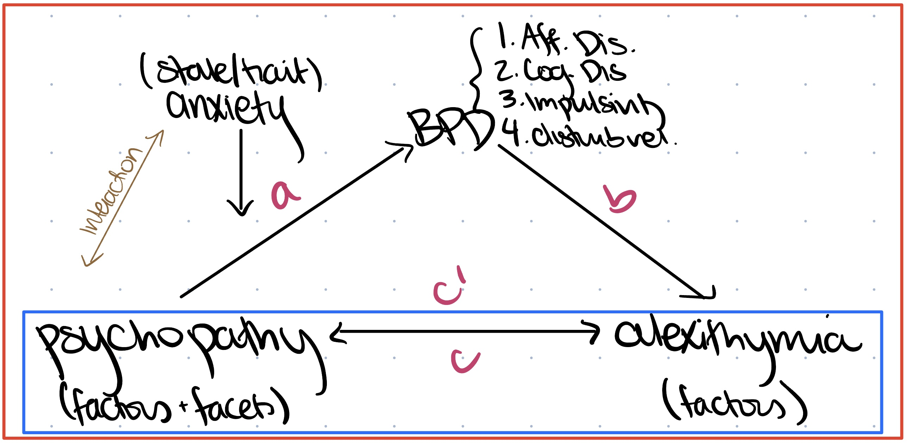
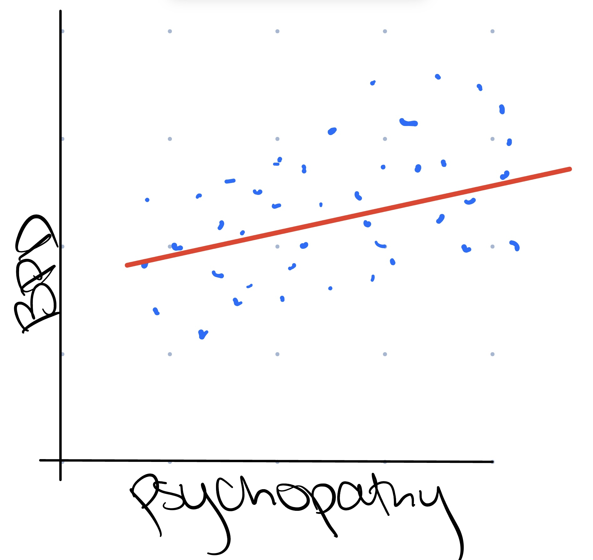
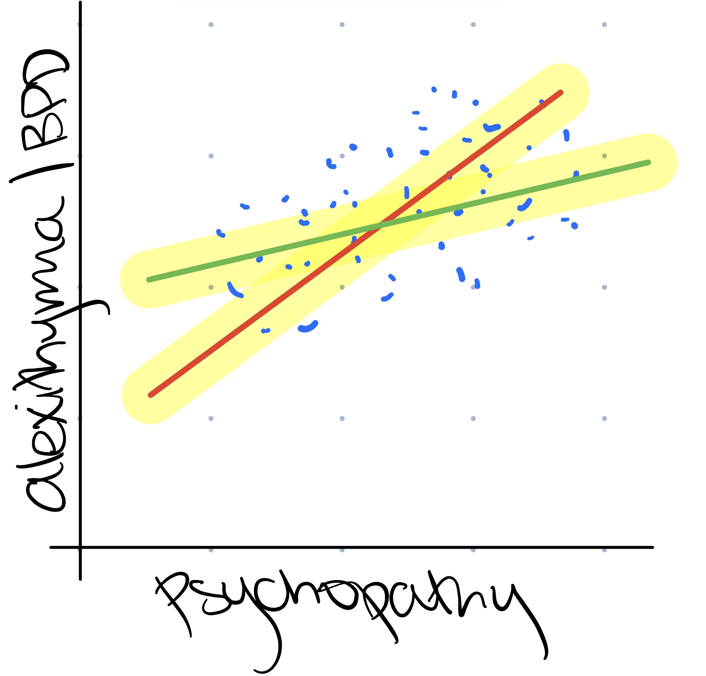

```{r setup, include = FALSE}
library("papaja")
library(tidyverse)
library(ggsci)
library(mediation)
r_refs("r-references.bib")
getwd()
setwd("../Documentation/")
theme_set(theme_classic(base_family = "serif"))
```

```{r analysis-preferences}
# Seed for random number generation
set.seed(42)
knitr::opts_chunk$set(cache.extra = knitr::rand_seed)
```


# Methods
We report how we determined our sample size, all data exclusions (if any), all manipulations, and all measures in the study. <!-- 21-word solution (Simmons, Nelson & Simonsohn, 2012; retrieved from http://ssrn.com/abstract=2160588) -->

## Participants

## Material

## Procedure

## Data analysis
We used `r cite_r("r-references.bib")` for all our analyses.


# Results

``` {r, PCLR descriptives}

filtered_wide_data <- read.csv("filtered_wide_data.csv")

ggplot(data = filtered_wide_data, aes(x = PCLR_Total_Score_Prorated)) +
  geom_density(color = "saddlebrown") +
  ggtitle("Density Plot of Psychopathy") +
  labs(x = "PCL-R", y = "Density") +
  xlim(0,40)

ggplot(data = filtered_wide_data, aes(x = PCLR_Total_Score_Prorated)) +
  geom_histogram(fill = "seagreen", color = "black", binwidth = 2) +
  scale_y_continuous(limits = c(0,12), breaks = seq(0, 12, 2)) +
  ggtitle("Histogram of Psychopathy") +
  labs(x = "PCL-R", y = "Count") +
  xlim(0,40)

```

```{r, STAI descriptives}

ggplot(data = filtered_wide_data, aes(x = STAI_Trait_Anxiety)) +
  geom_density(color = "saddlebrown") +
  ggtitle("Density Plot of Trait Anxiety") +
  labs(x = "STAI_Trait", y = "Density") +
  xlim(0,80)

ggplot(data = filtered_wide_data, aes(x = STAI_Trait_Anxiety)) +
  geom_histogram(fill = "seagreen", color = "black", binwidth = 2) +
  scale_y_continuous(limits = c(0,10), breaks = seq(0, 10, 2)) +
  ggtitle("Histogram of Trait Anxiety") +
  labs(x = "STAI_Trait", y = "Count") +
  xlim(20,80)

```

```{r, PAI descriptives}

ggplot(data = filtered_wide_data, aes(x = PAIBOR_Total_Score)) +
  geom_density(color = "saddlebrown") +
  ggtitle("Density Plot of BPD") +
  labs(x = "PAI-BOR", y = "Density") +
  xlim(0,65)

ggplot(data = filtered_wide_data, aes(x = PAIBOR_Total_Score)) +
  geom_histogram(fill = "seagreen", color = "black", binwidth = 2) +
  scale_y_continuous(limits = c(0,10), breaks = seq(0, 10, 2)) +
  ggtitle("Histogram of BPD") +
  labs(x = "PAI-BOR", y = "Count") +
  xlim(0,65)

```

```{r, TAS descriptives}

ggplot(data = filtered_wide_data, aes(x = TAS_Total_Score)) +
  geom_density(color = "saddlebrown") +
  ggtitle("Density Plot of Alexithymia") +
  labs(x = "TAS", y = "Density") +
  xlim(0,80)

ggplot(data = filtered_wide_data, aes(x = TAS_Total_Score)) +
  geom_histogram(fill = "seagreen", color = "black", binwidth = 2) +
  scale_y_continuous(limits = c(0,10), breaks = seq(0, 10, 2)) +
  ggtitle("Histogram of Alexithymia") +
  labs(x = "TAS", y = "Count") +
  xlim(20,80)

```

``` {r simple plot of mediation relationship, echo=FALSE, out.width='100%'}

# this visual is to generically demonstrate the relationship i will be looking at


read.csv("filtered_wide_data.csv")

library(diagram)
data <- c(0, "'*'", 0,
          0, 0, 0, 
          "'*'", "'*'", 0)
M <- matrix (nrow=3, ncol=3, byrow = TRUE, data=data)
plot <- plotmat (M, pos=c(1,2), 
            name= c( "BPD","Psychopathy \n X \n Anxiety", "Alexithymia"), 
            box.type = "rect", box.size = 0.14, box.prop=0.5,  curve=0)
# need to make clearer (not sure how) or change code to represent same graphic
```

(ref:c-path-caption) Scatterplot demonstrating relationship between the interactive term of psychopathy and trait anxiety with alexithymia in our sample of incarcerated women.

```{r c-path-scatterplot, fig.cap="(ref:c-path-caption)", echo=FALSE, out.width='100%'}

# this graph is to confirm a statistically significant relationship between psychopathyXanxiety (interactive predictor) and alexithymia (outcome)

ggplot(filtered_wide_data, aes(x = PCLR_STAI_Trait, y = TAS_Total_Score)) +
  geom_smooth(method = "lm", color = "black") +
  geom_point(color = "seagreen") + 
  labs(x = "Psychopathy X Anxiety", y = "Alexithymia", title = "Relationship between Psychopathy X Anxiety, Alexithymia")

psytascorrelation <- cor(filtered_wide_data$PCLR_STAI_Trait, filtered_wide_data$TAS_Total_Score)
print(psytascorrelation)

```

(ref:a-path-caption) Scatterplot demonstrating relationship between the interactive term of psychopathy and trait anxiety with borderline personality disorder in our sample of incarcerated women.

``` {r a-path-scatterplot, fig.cap="(ref:c-path-caption)", echo=FALSE, out.width='100%'}

# this graph is to confirm a statistically significant relationship between psychopathyXanxiety (interactive predictor) and BPD (mediator)


ggplot(filtered_wide_data, aes(x = PCLR_STAI_Trait, y = PAIBOR_Total_Score)) +
  geom_smooth(method = "lm", color = "black") +
  geom_point(color = "seagreen") + 
  labs(x = "Psychopathy X Anxiety", y = "BPD", title = "Relationship between Psychopathy X Anxiety, BPD")

psybpdcorrelation <- cor(filtered_wide_data$PCLR_STAI_Trait, filtered_wide_data$PAIBOR_Total_Score)
print(psybpdcorrelation)

```

``` {r mediation plot, echo=FALSE, out.width='100%'}

# this graph is to answer my research question: how is the relationship between psychopathyXanxiety and alexithymia impacted by the inclusion of BPD symptoms?


c.path <- lm(TAS_Total_Score ~ PCLR_STAI_Trait, data = filtered_wide_data)
summary(c.path) # significant relationship between predictor and outcome
c1.path <- lm(TAS_Factor1_Difficulty_Identifying_Feeling ~ PCLR_STAI_Trait, data = filtered_wide_data)
summary(c1.path) # significant relationship between predictor and one part of outcome
c2.path <- lm(TAS_Factor2_Difficulty_Describing_Feelings ~ PCLR_STAI_Trait, data = filtered_wide_data)
summary(c2.path) # significant relationship between predictor and another part of outcome
c3.path <- lm(TAS_Factor3_Externally_Oriented_Thinking ~ PCLR_STAI_Trait, data = filtered_wide_data)
summary(c3.path) # (trending) significant relationship between predictor and third part of outcome
a.path <- lm(PAIBOR_Total_Score ~ PCLR_STAI_Trait, data = filtered_wide_data)
summary(a.path) # significant relationship between predictor and mediator
bc.path <- lm(TAS_Total_Score ~ PCLR_STAI_Trait + PAIBOR_Total_Score, data = filtered_wide_data)
summary(bc.path)

mediator_model_total <- lm(PAIBOR_Total_Score ~ PCLR_STAI_Trait, data = filtered_wide_data)
model_total <- lm(TAS_Total_Score ~ PCLR_STAI_Trait + PAIBOR_Total_Score, data = filtered_wide_data)
mediation_result_total <- mediate(mediator_model_total, model_total, treat = "PCLR_STAI_Trait", mediator = "PAIBOR_Total_Score", boot=TRUE, sims=500)
plot(mediation_result_total)
summary(mediation_result_total) # full mediation?!

mediator_model_tasf1 <- lm(PAIBOR_Total_Score ~ PCLR_STAI_Trait, data = filtered_wide_data)
model_tasf1 <- lm(TAS_Factor1_Difficulty_Identifying_Feeling ~ PCLR_STAI_Trait + PAIBOR_Total_Score, data = filtered_wide_data)
mediation_result_tasf1 <- mediate(mediator_model_tasf1, model_tasf1, treat = "PCLR_STAI_Trait", mediator = "PAIBOR_Total_Score", boot=TRUE, sims=500)
plot(mediation_result_tasf1)
summary(mediation_result_tasf1) # full mediation?!

mediator_model_tasf2 <- lm(PAIBOR_Total_Score ~ PCLR_STAI_Trait, data = filtered_wide_data)
model_tasf2 <- lm(TAS_Factor2_Difficulty_Describing_Feelings ~ PCLR_STAI_Trait + PAIBOR_Total_Score, data = filtered_wide_data)
mediation_result_tasf2 <- mediate(mediator_model_tasf2, model_tasf2, treat = "PCLR_STAI_Trait", mediator = "PAIBOR_Total_Score", boot=TRUE, sims=500)
plot(mediation_result_tasf2)
summary(mediation_result_tasf2) # full mediation?!

mediator_model_tasf3 <- lm(PAIBOR_Total_Score ~ PCLR_STAI_Trait, data = filtered_wide_data)
model_tasf3 <- lm(TAS_Factor3_Externally_Oriented_Thinking ~ PCLR_STAI_Trait + PAIBOR_Total_Score, data = filtered_wide_data)
mediation_result_tasf3 <- mediate(mediator_model_tasf3, model_tasf3, treat = "PCLR_STAI_Trait", mediator = "PAIBOR_Total_Score", boot=TRUE, sims=500)
plot(mediation_result_tasf3)
summary(mediation_result_tasf3) # effect goes away... so interesting!!!!

## bar graph (with error bars) showing breakdown of total effects?
## add in some controlling variables might be able to explain more of model

## I want to add a scatter plot of predictor on outcome with original slope of relationship and new slope mapped on top, but have to fix m at a certain value (maybe sample average) in order to produce a line. representative of change in slope but not all values

## should i standardize??

```

``` {r structural equation modeling of factors}

# i have in my dataset factors that break down psychopathy, BPD, and alexithymia
# i think, especially for BPD(ZAN), it would be cool to analyze how these different factors might play into the relationship differently
# this reasoning is due to the inherent heterogeneity of what we consider in the literature to constitute a BPD diagnosis
# i have no idea how to approach this question though, and need to do more research into structural equation modeling (which i was told might be a useful approach here)

```

# Discussion

# Header A
* **bananas**
* *carrots*
* eggs

## Header B
1. France
2. Spain
3. **_Australia_**

### Header C
[R class website](https://nrdowling.github.io/d2m/index.html)
<!-- reference this page whenever you have questions -->

\newpage

# References

::: {#refs custom-style="Bibliography"}
:::
