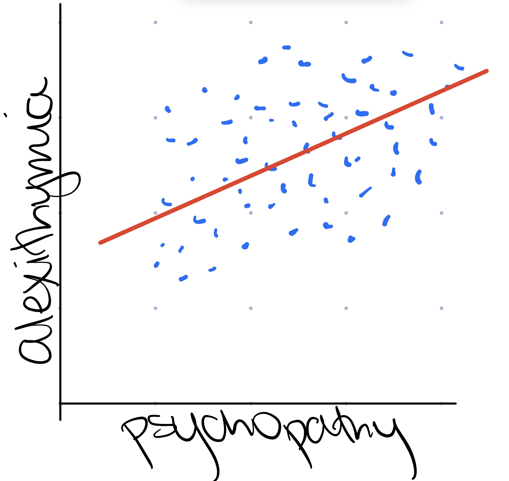

```{r setup, include = FALSE}
library("papaja")
library(tidyverse)
r_refs("r-references.bib")
getwd()
setwd("../Tests/")
source("assignment 2.R")
```

```{r analysis-preferences}
# Seed for random number generation
set.seed(42)
knitr::opts_chunk$set(cache.extra = knitr::rand_seed)
```

```{r callhello_worldfunction}
getwd()
setwd("../Code/")
source("defining-functions.R")
call("hello_world")
```


# Methods
We report how we determined our sample size, all data exclusions (if any), all manipulations, and all measures in the study. <!-- 21-word solution (Simmons, Nelson & Simonsohn, 2012; retrieved from http://ssrn.com/abstract=2160588) -->

## Participants

## Material

## Procedure

## Data analysis
We used `r cite_r("r-references.bib")` for all our analyses.

```{r PAI_BOR_data_readin}

getwd()
setwd("../localonly/") # I don't know if I should be doing this every time but it's the only way I've figured out how to set path

library(readxl)

messy_PAI_BOR_df1 <- read_excel("Decety_assessment_data_copy.xlsx", sheet = "PAI_BOR", range = cell_cols("A")) # grab ID column
messy_PAI_BOR_df2 <- read_excel("Decety_assessment_data_copy.xlsx", sheet = "PAI_BOR", range = cell_cols("Z")) # grab PAI total score column
messy_PAI_BOR_df <- cbind(messy_PAI_BOR_df1, messy_PAI_BOR_df2) # combine 2 columns into one dataframe displaying unique ID and PAI BOR total score

print(messy_PAI_BOR_df)

# my data here is tidy since i only copied over columns i needed. however, this is a very simplified version of all the data i will be using. i purposefully picked an 'easy' sheet to practice with.
# the original sheet had score ticks for each question. for my purposes, this information was unnecessary.
  
```

```{r create_PAI_BOR_intermediate_dataset}

# 2 dplyr functions for pai-bor
# filter out non -1001 data points
PAIBOR_Total_Score <- ("PAIBOR_Total_Score")
filtered_messy_PAI_BOR_df <- messy_PAI_BOR_df %>% filter(PAIBOR_Total_Score > 0)
print(filtered_messy_PAI_BOR_df)

# arrange lowest to highest
sorted_filtered_messy_PAI_BOR_df <- filtered_messy_PAI_BOR_df %>% arrange(PAIBOR_Total_Score)
print(sorted_filtered_messy_PAI_BOR_df)

write.csv(sorted_filtered_messy_PAI_BOR_df, "cleanish_PAIBOR_sorted_filtered.csv", row.names = FALSE)
# not sure if I should keep lowest to highest as that ruins the order for the other sheets. it was a good test

```

# Results

``` {r simple plot of mediation relationship, echo=FALSE, out.width='100%'}

# this visual is to generically demonstrate the relationship i will be looking at


read.csv("filtered_wide_data.csv")

library(diagram)
data <- c(0, "'*'", 0,
          0, 0, 0, 
          "'*'", "'*'", 0)
M <- matrix (nrow=3, ncol=3, byrow = TRUE, data=data)
plot <- plotmat (M, pos=c(1,2), 
            name= c( "BPD","Psychopathy \n X \n Anxiety", "Alexithymia"), 
            box.type = "rect", box.size = 0.14, box.prop=0.5,  curve=0)
# need to make clearer (not sure how) or change code to represent same graphic
```

```{r scatterplot of c path, echo=FALSE, out.width='100%'}

# this graph is to confirm a statistically significant relationship between psychopathyXanxiety (interactive predictor) and alexithymia (outcome)


ggplot(filtered_wide_data, aes(x = PCLR_STAI_Trait, y = TAS_Total_Score)) +
  geom_point() + 
   geom_smooth(method = "loess", se = FALSE)
# need to make prettier
psytascorrelation <- cor(filtered_wide_data$PCLR_STAI_Trait, filtered_wide_data$TAS_Total_Score)
print(psytascorrelation)

```

``` {r scatterplot of a path, echo=FALSE, out.width='100%'}

# this graph is to confirm a statistically significant relationship between psychopathyXanxiety (interactive predictor) and BPD (mediator)


ggplot(filtered_wide_data, aes(x = PCLR_STAI_Trait, y = PAIBOR_Total_Score)) +
  geom_point() + 
   geom_smooth(method = "loess", se = FALSE)
# so cool! need to make prettier though. not sure if want to do linear instead of lowess
psybpdcorrelation <- cor(filtered_wide_data$PCLR_STAI_Trait, filtered_wide_data$PAIBOR_Total_Score)
print(psybpdcorrelation)

```

``` {r mediation plot, echo=FALSE, out.width='100%'}

# this graph is to answer my research question: how is the relationship between psychopathyXanxiety and alexithymia impacted by the inclusion of BPD symptoms?


library(mediation)

c.path <- lm(TAS_Total_Score ~ PCLR_STAI_Trait, data = filtered_wide_data)
summary(c.path) # significant relationship between predictor and outcome
c1.path <- lm(TAS_Factor1_Difficulty_Identifying_Feeling ~ PCLR_STAI_Trait, data = filtered_wide_data)
summary(c1.path) # significant relationship between predictor and one part of outcome
c2.path <- lm(TAS_Factor2_Difficulty_Describing_Feelings ~ PCLR_STAI_Trait, data = filtered_wide_data)
summary(c2.path) # significant relationship between predictor and another part of outcome
c3.path <- lm(TAS_Factor3_Externally_Oriented_Thinking ~ PCLR_STAI_Trait, data = filtered_wide_data)
summary(c3.path) # (trending) significant relationship between predictor and third part of outcome
a.path <- lm(PAIBOR_Total_Score ~ PCLR_STAI_Trait, data = filtered_wide_data)
summary(a.path) # significant relationship between predictor and mediator
bc.path <- lm(TAS_Total_Score ~ PCLR_STAI_Trait + PAIBOR_Total_Score, data = filtered_wide_data)
summary(bc.path)

mediator_model_total <- lm(PAIBOR_Total_Score ~ PCLR_STAI_Trait, data = filtered_wide_data)
model_total <- lm(TAS_Total_Score ~ PCLR_STAI_Trait + PAIBOR_Total_Score, data = filtered_wide_data)
mediation_result_total <- mediate(mediator_model_total, model_total, treat = "PCLR_STAI_Trait", mediator = "PAIBOR_Total_Score", boot=TRUE, sims=500)
plot(mediation_result_total)
summary(mediation_result_total) # full mediation?!

mediator_model_tasf1 <- lm(PAIBOR_Total_Score ~ PCLR_STAI_Trait, data = filtered_wide_data)
model_tasf1 <- lm(TAS_Factor1_Difficulty_Identifying_Feeling ~ PCLR_STAI_Trait + PAIBOR_Total_Score, data = filtered_wide_data)
mediation_result_tasf1 <- mediate(mediator_model_tasf1, model_tasf1, treat = "PCLR_STAI_Trait", mediator = "PAIBOR_Total_Score", boot=TRUE, sims=500)
plot(mediation_result_tasf1)
summary(mediation_result_tasf1) # full mediation?!

mediator_model_tasf2 <- lm(PAIBOR_Total_Score ~ PCLR_STAI_Trait, data = filtered_wide_data)
model_tasf2 <- lm(TAS_Factor2_Difficulty_Describing_Feelings ~ PCLR_STAI_Trait + PAIBOR_Total_Score, data = filtered_wide_data)
mediation_result_tasf2 <- mediate(mediator_model_tasf2, model_tasf2, treat = "PCLR_STAI_Trait", mediator = "PAIBOR_Total_Score", boot=TRUE, sims=500)
plot(mediation_result_tasf2)
summary(mediation_result_tasf2) # full mediation?!

mediator_model_tasf3 <- lm(PAIBOR_Total_Score ~ PCLR_STAI_Trait, data = filtered_wide_data)
model_tasf3 <- lm(TAS_Factor3_Externally_Oriented_Thinking ~ PCLR_STAI_Trait + PAIBOR_Total_Score, data = filtered_wide_data)
mediation_result_tasf3 <- mediate(mediator_model_tasf3, model_tasf3, treat = "PCLR_STAI_Trait", mediator = "PAIBOR_Total_Score", boot=TRUE, sims=500)
plot(mediation_result_tasf3)
summary(mediation_result_tasf3) # effect goes away... so interesting!!!!

```

``` {r structural equation modeling of factors}

# i have in my dataset factors that break down psychopathy, BPD, and alexithymia
# i think, especially for BPD(ZAN), it would be cool to analyze how these different factors might play into the relationship differently
# this reasoning is due to the inherent heterogeneity of what we consider in the literature to constitute a BPD diagnosis
# i have no idea how to approach this question though, and need to do more research into structural equation modeling (which i was told might be a useful approach here)

```

# Discussion

# Header A
* **bananas**
* *carrots*
* eggs

## Header B
1. France
2. Spain
3. **_Australia_**

### Header C
[R class website](https://nrdowling.github.io/d2m/index.html)
<!-- reference this page whenever you have questions -->

\newpage

# References

::: {#refs custom-style="Bibliography"}
:::
