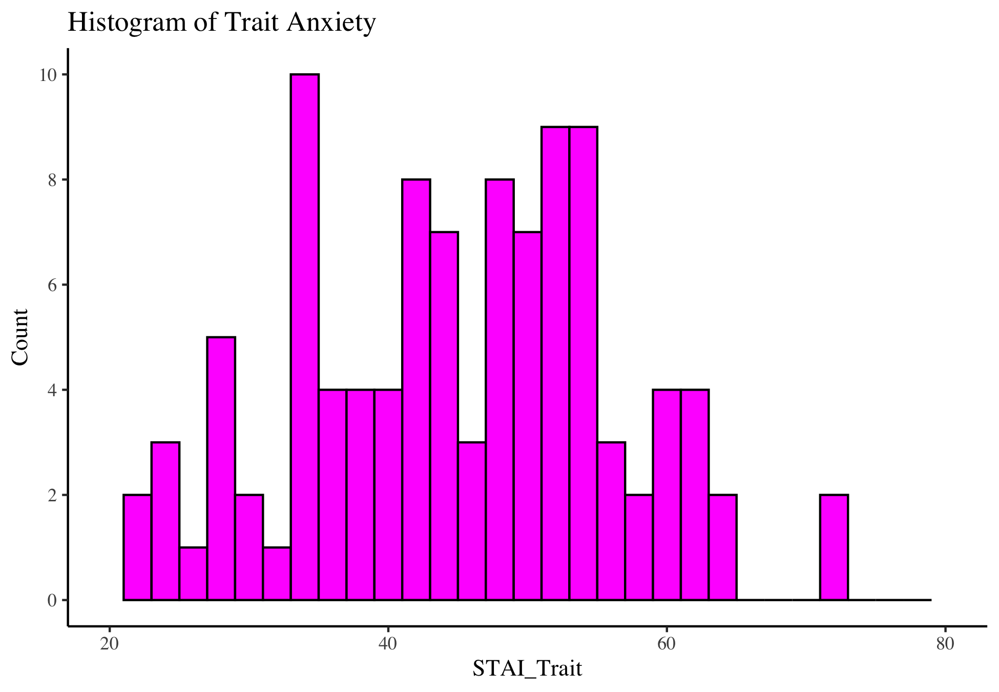
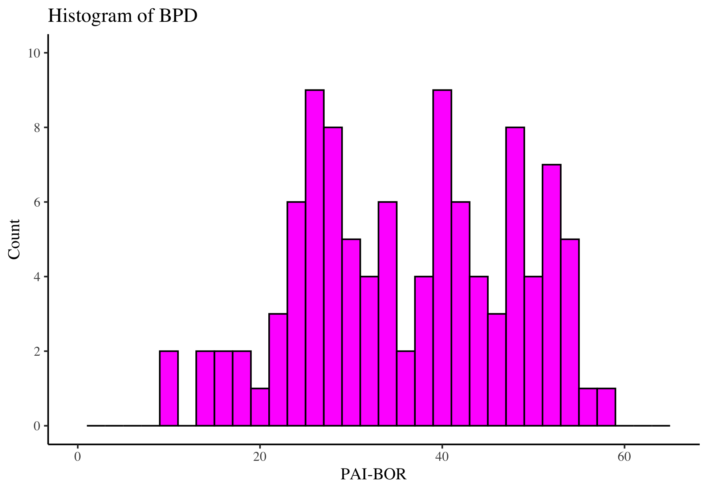
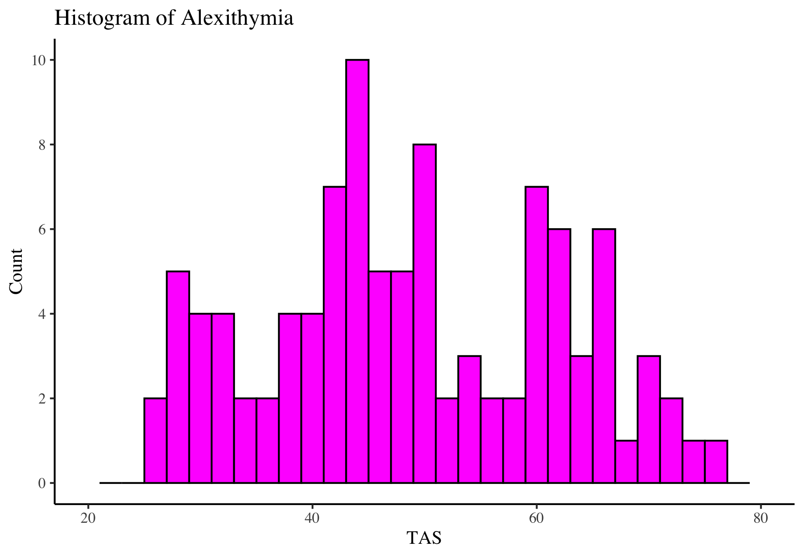

```{r setup, include = FALSE}
chooseCRANmirror(ind=65)
library(Require)
library(papaja)
library(tidyverse)
library(psych)
library(stats)
Require("diagram")
Require("mediation")
Require("stargazer")
Require("mosaic")
library(citr)
r_refs("r-references.bib")
#setwd()
theme_set(theme_classic(base_family = "serif"))
```

```{r analysis-preferences}
# Seed for random number generation
set.seed(42)
knitr::opts_chunk$set(cache.extra = knitr::rand_seed)
filtered_wide_data <- read.csv("Data/filtered_wide_data.csv")
```


*“Psychopathy is a multifaceted organism, and to adequately appreciate this construct and its prognostic implications, we need to consider all of its moving parts.”*

-- Scott Lilienfeld, 2018, p.79

# Background

Psychopathy comprises a bevy of maladaptive traits. Due to its elusive etiology, the construct has undergone detailed iterations annotating its idiosyncrasies. Analyses of biological and behavioral patterns have received significant attention in this regard. While persistent antisocial conduct is commonly present, psychopathy is also uniquely characterized by absences – notably a deficiency in emotional reaction and a lack of empathy or remorse [@debritoPsychopathy2021; @sellbomClassificationPsychopathy2021]. It spans race, gender, socioeconomic status, and culture, and further possesses a kaleidoscope of consequences – from disturbed well-being to increased involvement in the criminal justice system. While it is believed to be present in around 1% of the general population, an estimated 15-25% of those incarcerated are likely to fall somewhere on the psychopathy spectrum [@barbaraburtonPsychopathyInsightsGeneral2020].

## Defining Psychopathy and its Subtypes

At its core, psychopathy can be recognized as a weak manifestation of prosocial attributes, and an over-adaptation of egoistic traits [@lynamPsychopathyPersonalityArticulation2018]. During its investigative infancy, psychopathy was often examined as a homogenous construct [see @bergMisconceptionsRegardingPsychopathic2013]. The resulting dichotomy – that one can either be completely psychopathic or not at all – led scholars in the field to debate fiercely over fine lines of classification, thus engendering numerous misconceptions about its clinical detection and diagnosis [@sellbomClassificationPsychopathy2021]. There now exist two schools of thought: that psychopathy is either a taxonomy or a dimension [@waltersLatentStructurePsychopathy2007]. Strong arguments in recent for a dimensional approach have surfaced, contending psychopathic inclinations merely fall at the extreme ends of personality spectra [@lynamPsychopathyPersonalityArticulation2018]. Citing the Five-Factor Model [@mccraeIntroductionFiveFactor1992], those demonstrating psychopathy are often lacking in agreeableness and conscientiousness, while maintaining high expression of behaviors related to neuroticism and extraversion. Guided by the evidential multidimensionality of psychopathy, this shift has encouraged the development of myriad well-designed measures aimed at capturing various “trait constellations” [@sellbomClassificationPsychopathy2021]. Locating the traits of psychopathy along the landscape of broader personality literature – as will be done here – serves to further elucidate the heterogeneity that camouflages itself in these unidimensional measures. As they are most relevant to the present study, this paper will discuss primary and secondary variants, as well as the two-factor, four-facet model.

A discrimination in subtypes of psychopathy was pioneered by Karpman [-@karpmanNeedSeparatingPsychopathy1941], who proposed the existence of two groups: primary and secondary. Primary psychopaths are exceedingly low in anxiety and antisocial by genetic predisposition, whereas secondary psychopaths become callous and high in anxiety as a response to various vulnerabilities in the environment [@sellbomClassificationPsychopathy2021]. The two variants have been shown to manifest a “theoretically coherent pattern of differences” relative to their nonpsychopathic counterparts [@skeemTwoSubtypesPsychopathic2007, p. 395]. Due to its relatively clear distinction, significant ensuing research has delineated facets of the construct based on persons classified as exhibiting either primary or secondary psychopathy. The heterogeneity of psychopathy measurement and categorization in the present literature builds a slight barrier to the drawing of fully developed conclusions. While primary and secondary psychopathy are not directly assessed in the present study, useful comparisons can be drawn across schemata that highlight a valuable theoretical lineage.

The most widely investigated measure of psychopathy to-date originates in Cleckley’s [-@cleckleyMaskSanityAttempt1976] conception of psychopathy. The framework is divided into interpersonal-affective – or Factor 1 – traits and lifestyle-antisocial – or Factor 2 – traits. Factor 1 traits include superficial charm, a grandiose sense of self-worth, and lack of empathy or remorse; Factor 2 traits are characterized by early behavioral problems and delinquency, as well as impulsivity and a proneness to boredom [@debritoPsychopathy2021]. Research has demonstrated modest to strong heritability of Factor 1 traits, whereas Factor 2 traits demand more diverse genetic to environmental ratios [@blonigenPsychopathicPersonalityTraits2005]. These factors are distinct [@huntGeneticEnvironmentalOverlap2015] yet are not, however, mutually exclusive; persons demonstrating high interactions of Factor 1 and Factor 2 traits are subsequently labeled high in psychopathic tendencies, and diluted exhibitions in one or the other consequentially fall lower on the spectrum [@veronaGenderFactorlevelInteractions2012]. The Psychopathy Checklist—Revised [PCL--R\; @hare2003psychopathy] borne from this composition, and it is the chief measure of psychopathy that will be utilized in the present study. Ample evidence favors psychopathy presenting as dimensional in structure, and taxometric studies attest to instrument’s ability to capture this [@edensPsychopathicNotPsychopath2006; @waltersLatentStructurePsychopathy2007]. In other words, differing scores on the PCL—R reflect variations in degree rather than variations in kind. Being both reliable and well-validated across diverse samples, the PCL—R presents itself as the gold standard for analysis of unique expressions of psychopathy [@vitaleUsingPsychopathyChecklist2001]. That being said, more analytical attention needs to be given to a full range of scores, not only those falling above an arbitrary cutoff. 

## Psychopathy in Women

Prior neurobiological research regarding grey matter has demonstrated that the brains of men and women are often distinguishable [@andersonMachineLearningBrain2019]. As such, it is important to take gender into account when examining variability in psychopathology. Investigating gender differences advances our understanding of how social and cultural factors enter a feedback loop to reciprocally influence each other. Research in this area broadens the construct of psychopathy to include diverse mechanisms that embody both individual and group heterogeneity. 

Around 1.2% of American men and 0.5% of American women are believed to possess clinically significant levels of psychopathic traits [@barbaraburtonPsychopathyInsightsGeneral2020]. Due to this relative disparity, research establishing these models focused almost exclusively on male populations; there has only been scattered interest to determine how this construct may manifest uniquely within women [@veronaRevisitingPsychopathyWomen2013; @vitaleUsingPsychopathyChecklist2001; @warrenPsychopathyWomenStructural2003].

Numerous discrepancies sparked interest in this discourse, namely a murky association with previously correlated externalizing disorders – such as antisocial personality disorder and narcissistic personality disorder [@devogelGenderDifferencesAssessment2016; @rutherfordGenderDifferencesRelationship1998] – and the consistent tendency for women to score lower than men across rating scales [@newhillPsychopathyScoresReveal2010; @spormannStructuralDifferencesPsychopathy2023]. While Cleckley’s criteria, for instance, are often considered immune to gender stereotypes, these divergences highlighted the possibility that researchers were examining the wrong traits, or perhaps searching for misrepresentative correlates [@vitaleUsingPsychopathyChecklist2001]. A sort of ‘eagerness to correct’ thus fostered among the community in light of these inconsistencies. That being said, paralleled documentation across psychopathic men and women continues to lag behind.

Seeking to bridge the gap, more recent studies have carved distinctive pathways for research into these gender-defined variances. Papers examining gender differences have found women with psychopathy to possess overall less significant deficits in emotional processing, as well as show less physical violence while exhibiting heightened manipulative and self-destructive behaviors, possibly from learning how to compensate through socialization [for a review, see @effersonExaminingGenderDifferences2018]; they are also more often diagnosed with borderline personality disorder compared to men with psychopathy [@devogelGenderDifferencesAssessment2016]. Expanding on this emergent association, Sprague and colleagues [-@spragueBorderlinePersonalityDisorder2012] found the interaction of Factor 1 and Factor 2 traits to directly associate to borderline personality diagnoses, specifically among women. This diverges from male psychopathy’s affinity with antisocial personality disorder. While both personality disorders are highly correlated with impulsivity and externalizing behaviors such as substance abuse, BPD is particularly unique in its manifestation of internalizing features such as self-injury and chronic emptiness [@beauchaineMultifinalityDevelopmentPersonality2009]. Suggestions have been made in the literature regarding the two condition’s mirrored etiology; comparison analyses reveal an emphasis on trait impulsivity and self-harm behaviors unique to borderline personality disorder, and a common developmental model has been proposed [@beauchaineMultifinalityDevelopmentPersonality2009]. How this may impact our composition of psychopathy and its comorbidities is discussed in the conclusion. These unified findings illuminate the possibility that psychopathy may paint a different picture on women versus men.

## Psychopathy and Borderline Personality Disorder

Borderline personality disorder (BPD) is characterized by unstable and explosive emotional patterns. Those diagnosed with BPD often struggle to both maintain relationships and inhibit chaotic impulses. Suicidal and self-injurious behavior are also quite prevalent in those diagnosed [@clarkinDefiningMechanismsBorderline2005]. It is estimated that 1.4% of the adult U.S. population is eligible for BPD diagnosis; nearly 75% of those diagnosed are women [@nationalinstituteofmentalhealthBorderlinePersonalityDisorder2023]. Research has further found that within its own composition, BPD is expressed distinctly on men and women [@zlotnickRoleGenderClinical2002a]. Zlotnick, Rothschild, and Zimmerman [-@zlotnickRoleGenderClinical2002a] found BPD-diagnosed women were more likely than BPD-diagnosed men to meet criteria for internalizing and impulse-defined comorbidities – such as eating disorder, panic disorder, and major depressive disorder.

These correlations paint an image of high levels of inner distress in the wake of negative affect for women with BPD, which may have interesting connotations for how it relates to coexisting conditions that also impact emotional regulation, such as psychopathy. Aiming to parse the heterogeneity of BPD, Newhill and colleagues used psychopathy as a mechanism to divide those diagnosed with BPD into four subgroups [@newhillPsychopathyScoresReveal2010]. It was found that women were more likely to fall into lower psychopathy types, as in line with previously noted findings. This further confirms the close relationship at play between the two conditions. In 2012, Blonigen and colleagues took this one step further to examine whether the presence of borderline traits can act as a mediator between other common comorbidities in female psychopaths, such as posttraumatic stress disorder. Using a sample of incarcerated women, data show a BPD diagnosis may act as a female-specific indicator of antisocial tendencies [@blonigenFacetsPsychopathyRelation2012]. These implications were further delineated in a study by Verona, Sprague, and Javdani [-@veronaGenderFactorlevelInteractions2012], which analyzed the role of BPD tendencies on the relationship between risk for self-directed violence and psychopathy in men and women. Findings concur that traits – specifically Factor 1 – express themselves uniquely, and there is likely overlap within gender [@veronaGenderFactorlevelInteractions2012]. When examining the role of psychopathy in the subsequent presentation of borderline tendencies, a promotive effect among Factor 1 traits and a protective effect among Factor 2 traits was found [@huntGeneticEnvironmentalOverlap2015]. In other words, high levels of impulsive-antisocial traits aggravated the development of BPD, whereas high levels of interpersonal-affective traits acted as a defense against internalizing forms of psychopathology and BPD evolution. More recently, a longitudinal study detected positive associations among secondary psychopathy, borderline personality disorder, and trait anxiety – another internalizing condition [@vaillancourtLongitudinalAssociationsPrimary2019]. This novel finding highlights the crucial role of emotional and psychopathological characteristics in the relationship between psychopathy and internalizing features in women.

## Emotional Mapping

Variability in conceptualizations of how emotions manifest in BPD has led researchers to question which facets play a more central role in relevant processing. In 2006, Gratz and colleagues sought to define more clearly features of emotional dysregulation in BPD. Results show those with BPD possess an increased hesitance to experience feelings of distress – even if in pursuit of a goal – which highlights the centrality of emotional avoidance and distress intolerance in BPD [@gratzExperimentalInvestigationEmotion2006; @iversonInvestigationExperientialAvoidance2012]. Dysregulation of this nature may lead to impaired social reactions, as those with BPD are not likely to maintain relationships if they sense oncoming conflict. Examining social-cognitive performance in BPD, Fenske and colleagues [-@fenskeEmotionRecognitionBorderline2015] further inferred that those diagnosed with BPD may also succumb to deficits in emotional recognition. It was found that women with BPD showed clear negative skews for positive and neutral facial expressions; they were significantly more likely to score someone’s emotional expression as poorer than healthy controls. This uniquely negative bias implies those with BPD do not possess a general deficit in recognition, but rather one “in the recognition of emotions without a negative valence” (p.8). In summary, emotion recognition seems to uniquely defect in BPD.

Further, those with psychopathy often possess deficits in recognition of fear and sadness [@blairCognitiveDevelopmentalApproach1995]. A recent meta-analysis was able to increase the statistical power of 26 independent studies to find significant impairments for emotions, regardless of whether they were negative or positive [@dawelNotJustFear2012]. These findings even remained significant across facial and vocal modalities when fear and sadness were excluded. Secondary psychopathy has further been associated with self-perceived deficits in both experiencing and regulating emotion [@burnsEvaluatingEmotionProcessing2015]. Neuroimaging data support these findings, showing that highly psychopathic males elicit reduced neuro-hemodynamic responses across facial processing networks when prompted with multiple categories of facial expressions, including happiness and pain [@decetyNeuralProcessingDynamic2014]. It becomes evident pervasive and widespread deficits in the area of emotion processing are likely to exist when psychopathy is present. The impact of gender has yet to be examined. It should be mentioned that the above data underscore a unique contradiction: those with BPD seem to be hypersensitive to negative emotion, while those with psychopathy possess a deficit to similarly connoted feelings. As such, exploring what happens when these two conditions co-occur would provide powerful insight as to how psychopathic tendencies collide with personality disorders, and it may be especially useful for clinical decision-making and treatment design.

Alexithymia is a syndrome marked by hindrances in experiencing, identifying, and expressing emotions. Like psychopathy, the construct is multifaceted and possesses both cognitive and affective components [@goerlichMultifacetedNatureAlexithymia2018]. While alexithymia can be present at birth, significant research suggests alexithymia may develop in an adaptive way to reduce the stress associated with overwhelming or unbearable emotions [@karukiviDevelopmentAlexithymicPersonality2014]. Despite overlapping manifestations, forensic research on the comorbidity of psychopathy and alexithymia has determined the two constructs to present distinctly [@louthPsychopathyAlexithymiaFemale1998]. Thus, studies that aim to parse apart where the lines are drawn between the two is necessary. 

Decreased emotional awareness may thwart social development, making alexithymia highly pertinent to both daily functioning and the onset of psychiatric disorders. As traits of both psychopathy and BPD evidently alter emotional regulation and processing, it is likely associations would be found between its diagnosis and the presence of alexithymia. It has been hypothesized in the literature that alexithymia is likely to possess a positive association with secondary versus primary psychopathy as it is more closely related to emotion dysregulation [@landerDifferentialAssociationAlexithymia2012]. Findings have been more mixed regarding factor classifications of psychopathy [@burghartNoFeelingsMe2022]. In 2012, Lander and colleagues proposed a distinction in psychopathic variants and alexithymia: significant, positive associations were found between alexithymia and secondary, but not primary, psychopathy. It was suggested that emotional dysregulation may account for the overlap in secondary psychopathy and alexithymia. Building on this, Ridings & Lutz-Zois  [-@ridingsEmotionalDysregulationBorderline2014] suggested BPD may act as a mediator in the association between secondary psychopathy and alexithymia. While novel and informative, the study was conducted on an undergraduate population and self-report measures were used for psychopathy. In a meta-analysis, Burghart and Mier [-@burghartNoFeelingsMe2022] elicited positive associations between psychopathy and alexithymia, as well its sub-components – difficulty describing feelings, difficulty identifying feelings, and externally-oriented thinking. Examining gender as a moderator, they found the association between psychopathy and overall alexithymia to be stronger in women compared to men. 

It is unclear how thoroughly these findings might translate onto clinical or special populations. Special populations are useful for research as they can provide valuable insight along the margins of spectra that may be overlooked. We now stand at an intersection of extremities, as this study aims to clarify how the interaction between psychopathy and borderline personality disorder may impact one’s ability to experience, identify, or express emotions when impairments are more clinically severe.

## Neurological Implications and Relevant Theory

Neurological data further support the notion that deficits are pervasive across emotion for psychopaths [@decetyNeuralProcessingDynamic2014]. Male psychopaths have shown deficient processing in both the vmPFC and OFC – areas involved in emotional processing and expression – in response to other people’s distress [@decetyBrainResponseEmpathyEliciting2013]. Theoretical explanations of psychopathy often implicate a dysfunctional amygdala [@blairCognitiveDevelopmentalApproach1995; @daddsImpairedAttentionEyes2011]. Further, the amygdala –involved in perception of emotional valence and expression – uniquely demonstrated lowered activation in women but not in men [@phelpsEmotionCognitionInsights2006]. As such, aforementioned conclusions point to a discourse surrounding recent amygdalar theories of social-relevance processing [@daddsImpairedAttentionEyes2011; @dawelNotJustFear2012], further denoting the amygdala’s involvement in a wider range of social and emotional processing than previously believed, especially for women. As the amygdala seems to be consistently impaired in psychopaths across studies [@fusar-poliFunctionalAtlasEmotional2009], emotional deficits in psychopathy can be assumed to be quite debilitating, spanning a wider range than what has been demonstrated in BPD alone.

Empathy plays an intimate role in the relationship between one’s ability to recognize emotion and one’s decision to act in a prosocial manner. Copious research has analyzed how empathy is impacted by the presence of psychopathy, and a growing body of research looks at empathy’s interaction with alexithymia. Observing affective perspective taking in male psychopaths compared with healthy controls, one study denoted an inverse correlation between the amygdala and insular response with PCL—R Factor 1 traits when imagining someone else in pain [@decetyFMRIStudyAffective2013]. On alexithymia, those impacted often struggle to empathize, and the presence of alexithymic symptoms is often related to a low ability to relate to others [@grynbergAlexithymiaInterpersonalDomain2010; @guttmanAlexithymiaEmpathyPsychological2002]. Via MRI data, symptoms have been linked to deficits in emotional empathy and reduced volume in the left amygdala [@goerlich-dobreLeftAmygdalaShared2015]. In their analysis, Burghart and Mier [-@burghartNoFeelingsMe2022] further imply the possibility of alexithymia and psychopathy together impacting empathic experiences. This illustrates a certain level of overlap psychopathy and alexithymia pose in terms of their emotional expressions.

The existing bodies of work on psychopathy, personality, and emotion have led us to an exceptional junction. Heterogeneous evidence in both neurological and behavioral research supports the notion that the complexities of a ‘psychopathic personality’ continue to require investigative attention. Further, emotional deficits are seen to be pervasive in both borderline personality disorder and psychopathy. Sample pools either including or prioritizing women must claim a place in the forefront of this discourse in order to detail psychopathy is it applies to a broader population. 

# Present Aims

Stimulating research continues to emerge regarding the relationship between psychopathy and BPD, as well as emotional dysregulation and BPD. However, the impact BPD and psychopathy may have on women with respect to their ability to experience, identify, or express emotions is at present underexplored. Further, special populations are often underrepresented in research and thus critical to mapping out the spectrum of impact. We would like to build on the findings of Ridings & Lutz-Zois [-@ridingsEmotionalDysregulationBorderline2014] by exploring a similar relationship on a unique population. Both secondary psychopathy and alexithymia have been shown to develop in people as a way of coping with harsh or unbearable environments [@blonigenPsychopathicPersonalityTraits2005; @goerlichMultifacetedNatureAlexithymia2018]. As it is conceivable for one to exhibit symptoms of psychopathy and subsequently be impacted in their emotional perception, the interactive term of psychopathy and trait anxiety was utilized as the predictor, and alexithymia was utilized as the outcome variable. However, as with many comorbidities, psychopathy and alexithymia likely possess a cyclical relationship, which is critical to keep in mind when assessing findings. A primary aim of the present study is to delineate the clinical presentation of psychopathy in incarcerated women as it intersects with borderline personality disorder and alexithymia. Further, exploratory analyses are conducted regarding the impact of this relationship on the various factors of alexithymia. Poor empathy and emotional dysregulation render psychopathy a prevalent risk factor for severe and chronic violence. While criminality is not a certainty, understanding how the condition hardens along this lineage could have meaningful benefits in the clinical sphere and thus guide necessary treatment to lower both violent onset and recidivism rates. Treatment is especially pertinent for those in vulnerable populations who may be limited in access.

Due to its deviant nature, psychopathy has attracted copious attention in research. Initial theories were developed primarily on case studies of men [@cleckleyMaskSanityAttempt1976]. When research on female psychopaths began to garner attention, the construct was transposed [@hare2003psychopathy; @veronaRevisitingPsychopathyWomen2013; @vitaleUsingPsychopathyChecklist2001]. Yet, due to lower scores and misrepresentative correlates, there is reason to believe psychopathy does not paint an identical picture across the genders. 

Contrary to male psychopathy, female psychopathy has been shown to possess a much stronger association with tendencies of borderline personality disorder [@spragueBorderlinePersonalityDisorder2012]. It is hypothesized that increased psychopathy will exacerbate alexithymia symptoms in those with borderline personality disorder. The literature has made abundantly clear the manifold expressions of psychopathy; as such, it is important this diversity is accounted for in our research. Stratification by factor will be exploratory, as limited studies have delineated intra-construct distinctions [see @huntGeneticEnvironmentalOverlap2015 for an exception]. Results are likely to have implications for both forensic practice and neuroscientific theory. 


Contrary to male psychopathy, female psychopathy has been shown to possess a much stronger association with tendencies of borderline personality disorder [@spragueBorderlinePersonalityDisorder2012]. It is hypothesized that borderline personality disorder will mediate the relationship between psychopathy and alexithymia (see Figure\ \@ref(fig:mediation-graphic)). The literature has made abundantly clear the manifold expressions of psychopathy; as such, it is important this diversity is accounted for in our research. Results are likely to have implications for both forensic practice and neuroscientific theory.

``` {r mediation-graphic, echo=FALSE, out.width='100%', fig.cap='Mediation Graphic', label='mediation-graphic'}
data <- c(0, "", 0,
          0, 0, 0, 
          "", "", 0)
M <- matrix (nrow=3, ncol=3, byrow = TRUE, data=data)
plot <- plotmat (M, pos=c(1,2), 
            name= c( "BPD","Psychopathy \n X \n Anxiety", "Alexithymia"), 
            box.type = "rect", box.size = 0.14, box.prop = 0.5,  curve = 0, arr.lwd = 1)
```

# Methods
Data were collected via structured interviews and self-report measures. The presently used assessment battery is well-validated and has been strategically refined over the past decade in forensic research [@hervePsychopathTheoryResearch2007]. We report how we determined our sample size, all data exclusions (if any), all manipulations, and all measures in the study. <!-- 21-word solution (Simmons, Nelson & Simonsohn, 2012; retrieved from http://ssrn.com/abstract=2160588) -->

``` {r summary-table, results = 'asis'}
minimal_descriptives <- filtered_wide_data[,c(
  "PAIBOR_Total_Score", 
  "PCLR_Total_Score_Prorated", 
  "TAS_Total_Score", 
  "STAI_Trait_Anxiety")]
assessment_names <- c("PAI-BOR", "PCLR", "TAS", "STAI-Trait")
names(minimal_descriptives) <- assessment_names

stargazer(minimal_descriptives, 
          title = "Summary Table", 
          header = FALSE, 
          type = 'latex', 
          label = "tab:summary-table",
          digits = 1)
```

```{r age-stats}
filtered_age_values <- filtered_wide_data$Age[filtered_wide_data$Age != -1001]
mean_excluded <- mean(filtered_age_values)
sd_excluded <- sd(filtered_age_values)
```

## Participants
Collected over a four-year period, the present sample consists of 156 incarcerated females exhibiting varying levels of psychopathic and borderline tendencies. Participants range in age, from 20 to 53 (*M* = `r mean_excluded`, *SD* = `r sd_excluded`). Participants were randomly selected and subsequently informed of the nature of the study. Before screening, they were required to provide consent. Random selection was used to allow for a wide array of scores that could be systematically examined across the various facets of targeted measures.

## Measures

### Two-Factor Psychopathy
The Psychopathy Checklist—Revised (PCL—R) is a 20-item instrument operationalizing Hervey Cleckley’s seminal description of sixteen characteristics that exemplify psychopathy [@cleckleyMaskSanityAttempt1976; @hareManualHarePsychopathy]. This clinical conceptualization is considered the gold standard for assessing psychopathic features in forensic samples. Both a semi-structured interview and review of institutional records comprise the assessment. Total scores may range from 0 to 40. A score of 10-19 is akin with mild psychopathy, while a score of 20-29 is illustrative of moderate psychopathy. Scores above 30 are commonly associated with severe psychopathic symptoms.

### Borderline Personality Disorder
Individual dimensions of BPD were assessed using the Personality Assessment Inventory-Borderline Features scale [PAI—BOR\; @morey1991personality]. The PAI—BOR is a 24-item self-report measure that yields a four-factor model of BPD including affective instability, identity problems, negative relationships, and self-harm. The PAI—BOR scale has demonstrated both reliability and validity [@morey1991personality; @trullBorderlinePersonalityDisorder1995], as well as high sensitivity and specificity for individuals matching BPD criteria [@southwardIdentifyingCoreDeficits2018].

### Alexithymia and Emotion
The Toronto Alexithymia Scale [TAS-20\; @taylorRevisedTorontoAlexithymia1992] is a 20-item self-report measure designed to assess facets of alexithymia across three subscales: difficulty in identifying and distinguishing feelings within oneself, difficulty in describing feelings to others, and externally oriented thinking [@karukiviDevelopmentAlexithymicPersonality2014]. The scale has demonstrated high internal consistency [@henryCognitivePsychosocialCorrelates2006] and strong convergent and discriminant validity [@bagbyTwentyitemTorontoAlexithymia1994]. Total scores can range from 20 to 100. A score above 50 demonstrates the possibility of alexithymia, while a score above 60 illustrates strong alexithymic symptoms.

### Exploring Dimensions of Psychopathy
Primary and secondary psychopathy have been shown to diverge in levels of anxiety [@vaillancourtLongitudinalAssociationsPrimary2019]. Relative to primary psychopaths, secondary psychopaths possess higher levels of trait anxiety, exhibit more borderline symptoms, and have poorer interpersonal functioning [@burnsEvaluatingEmotionProcessing2015; @skeemTwoSubtypesPsychopathic2007]. It is likely alexithymia diverges across the dimensions of psychopathy. In line with prior research, it is predicted that secondary psychopathy, specifically, will exhibit a relationship with alexithymia in which BPD functions as a mediator. Precedence has been established in using the interaction between psychopathy scores and STAI-Trait scores as an index of secondary psychopathy [see @landerDifferentialAssociationAlexithymia2012; @vassilevaPsychopathyPsychopathiesClassifying2005]. As such, the interactive term – psychopathyXanxiety – will be utilized in the present study. STAI-Trait scores range from 20 to 80, with higher scores being indicative of higher trait anxiety [@spielberger1970stai]. In the literature, the assessment has shown to be a strong measure of general negative affect, as well as incorporating aspects of cognitive anxiety [@balsamoStateTraitAnxietyInventory2013].

## Procedure
All interviews were conducted by a clinical psychologist or trained research staff member. While incarcerated subjects are often reported as being highly reliable and compliant in psychological research [@decetyNeuralProcessingDynamic2014], special ethical concerns remain for incarcerated populations as various restrictions exist on autonomy, privacy, and healthcare services. Participants were allowed to rescind their data at any time.

## Data analysis
Of the 156 total participants, 52 participants failed to complete one or more of the four assessments. Due to the heterogeneous nature of the variables, it was determined most ethical to simply remove participants who were missing data for any of the required assessments. A total of 104 participants remained for further investigation. We used various `R` packages[^1] for all our analyses.

[^1]: `r cite_r("r-references.bib")`

# Results

(ref:PCLR-descriptives) Histogram of score distribution on the PCL--R.
``` {r PCLR-descriptives, fig.cap="(ref:PCLR-descriptives)", echo=FALSE, warning=FALSE, out.width='100%'}
ggplot(data = filtered_wide_data, aes(x = PCLR_Total_Score_Prorated)) +
  geom_histogram(fill = "magenta", color = "black", binwidth = 2) +
  scale_y_continuous(limits = c(0,12), breaks = seq(0, 12, 2)) +
  ggtitle("Histogram of Psychopathy") +
  labs(x = "PCL-R", y = "Count") +
  xlim(0,40)
```

Descriptive statistics for the assessments of interest can be seen in Table\ \@ref(tab:summary-table). As seen in Figure\ \@ref(fig:PCLR-descriptives), our distribution of PCL--R scores is left-skewed, with more participants falling on the higher end of the spectrum. This is consistent with past studies conducted with incarcerated populations [@decetyFMRIStudyAffective2013; @decetyNeuralProcessingDynamic2014]. Other score assessment distributions can be found in the [Supplemental Materials](#Supplemental-Materials) section.

(ref:STAI-descriptives) Histogram of score distribution on the STAI-Trait.
```{r STAI-descriptives, echo=FALSE, warning=FALSE, fig.cap="(ref:STAI-descriptives)", fig.show='hide'}
ggplot(data = filtered_wide_data, aes(x = STAI_Trait_Anxiety)) +
  geom_histogram(fill = "magenta", color = "black", binwidth = 2) +
  scale_y_continuous(limits = c(0,10), breaks = seq(0, 10, 2)) +
  ggtitle("Histogram of Trait Anxiety") +
  labs(x = "STAI_Trait", y = "Count") +
  xlim(20,80)
```

(ref:PAI-descriptives) Histogram of score distribution on the PAI-BOR.
```{r PAI-descriptives, echo=FALSE, warning=FALSE, fig.cap="(ref:PAI-descriptives)", fig.show='hide'}
ggplot(data = filtered_wide_data, aes(x = PAIBOR_Total_Score)) +
  geom_histogram(fill = "magenta", color = "black", binwidth = 2) +
  scale_y_continuous(limits = c(0,10), breaks = seq(0, 10, 2)) +
  ggtitle("Histogram of BPD") +
  labs(x = "PAI-BOR", y = "Count") +
  xlim(0,65)
```

(ref:TAS-descriptives) Histogram of score distribution on the TAS-20.
```{r TAS-descriptives, echo=FALSE, warning=FALSE, fig.cap="(ref:TAS-descriptives)", fig.show='hide'}
ggplot(data = filtered_wide_data, aes(x = TAS_Total_Score)) +
  geom_histogram(fill = "magenta", color = "black", binwidth = 2) +
  scale_y_continuous(limits = c(0,10), breaks = seq(0, 10, 2)) +
  ggtitle("Histogram of Alexithymia") +
  labs(x = "TAS", y = "Count") +
  xlim(20,80)
```

(ref:c-path-caption) Scatterplot demonstrating relationship between the interactive term of psychopathy and trait anxiety with alexithymia in our sample of incarcerated women.
```{r c-path-scatterplot, fig.cap="(ref:c-path-caption)", echo=FALSE, out.width='100%'}
ggplot(filtered_wide_data, aes(x = PCLR_Total_Score_Prorated, y = TAS_Total_Score, color = STAI_Trait_Anxiety)) +
  geom_smooth(method = "lm", color = "black") +
  geom_point() +
  scale_color_gradient(low = "blue", high = "red") +
  labs(x = "Psychopathy", y = "Alexithymia", title = "Relationship between Psychopathy, Anxiety, Alexithymia")
psytascorrelation <- corr.test(
  x = filtered_wide_data$PCLR_STAI_Trait,
  y = filtered_wide_data$TAS_Total_Score)
##fix anx label
```

Figure\ \@ref(fig:c-path-scatterplot) shows a moderate correlation between psychopathy and alexithymia ($r$ = `r psytascorrelation$r`). Participant scores on the STAI-Trait are illustrated by the color of each point. It appears that those lower in trait anxiety seem to fall on the lower on the spectrum of alexithymia. However, distinctions are hardly discernable across the PCL--R dimension. While not statistically calculated, these suppositions fall in line with prior research suggesting alexithymia may result from increased stress to the environment [@karukiviDevelopmentAlexithymicPersonality2014].

(ref:a-path-caption) Scatterplot demonstrating relationship between the interactive term of psychopathy and trait anxiety with borderline personality disorder in our sample of incarcerated women.
``` {r a-path-scatterplot, fig.cap="(ref:a-path-caption)", echo=FALSE, out.width='100%'}
ggplot(filtered_wide_data, aes(x = PCLR_Total_Score_Prorated, y = PAIBOR_Total_Score, color = STAI_Trait_Anxiety)) +
  geom_smooth(method = "lm", color = "black") +
  geom_point() + 
  scale_color_gradient(low = "blue", high = "red") +
  labs(x = "Psychopathy", y = "BPD", title = "Relationship between Psychopathy, Anxiety, BPD")
psybpdcorrelation <- corr.test(
  x = filtered_wide_data$PCLR_STAI_Trait,
  y = filtered_wide_data$PAIBOR_Total_Score)
##fix anx label
```

Figure\ \@ref(fig:a-path-scatterplot) shows a moderate to strong correlation between psychopathy and BPD (*r* = `r psybpdcorrelation$r`). Participant scores on the STAI-Trait are illustrated similarly here. The distribution of STAI-Trait scores appears to be more mixed here, which once again aligns with prior research regarding the presence of internalizing features such as anxiety across presentations of BPD [@beauchaineMultifinalityDevelopmentPersonality2009].

```{r standardizing-variables}
filtered_wide_data$PAIBOR_Total_Score_z <-
  zscore(filtered_wide_data$PAIBOR_Total_Score)
filtered_wide_data$PCLR_STAI_Trait_z <-
  zscore(filtered_wide_data$PCLR_STAI_Trait)
filtered_wide_data$TAS_Total_Score_z <-
  zscore(filtered_wide_data$TAS_Total_Score)
filtered_wide_data$TAS_Factor1_Difficulty_Identifying_Feeling_z <-
  zscore(filtered_wide_data$TAS_Factor1_Difficulty_Identifying_Feeling)
filtered_wide_data$TAS_Factor2_Difficulty_Describing_Feelings_z <-
  zscore(filtered_wide_data$TAS_Factor2_Difficulty_Describing_Feelings)
filtered_wide_data$TAS_Factor3_Externally_Oriented_Thinking_z <-
  zscore(filtered_wide_data$TAS_Factor3_Externally_Oriented_Thinking)
```

``` {r prelim-regression-input, echo=FALSE, out.width='100%'}
po_path <- lm(TAS_Total_Score_z ~ PCLR_STAI_Trait_z, 
              data = filtered_wide_data)
pm_path <- lm(PAIBOR_Total_Score_z ~ PCLR_STAI_Trait_z, 
              data = filtered_wide_data)
mo_path <- lm(TAS_Total_Score_z ~ PAIBOR_Total_Score_z, 
              data = filtered_wide_data)
```

``` {r prelim-regression-output, echo=FALSE, results='asis', warning=FALSE}
stargazer(po_path, pm_path, mo_path, title = "Preliminary Regression Results", header = FALSE, type = 'latex', dep.var.labels = c("P-O Path", "P-M Path", "M-O Path"), covariate.labels = c("PsychopathyXAnxiety", "BPD"), column.sep.width = "1pt", label = "tab:prelim-regression-output", out="prelim-regression-output.png")
```

All assessment scores, including the interactive term of psychopathy and trait anxiety, were standardized. In order to run a mediation analysis, one must ensure significant relationships exist between predictor and outcome, predictor and mediator, and mediator and outcome. The present data support these requirements, thus we were able to proceed with our mediation analysis. Results for these preliminary analyses can be seen in Table\ \@ref(tab:prelim-regression-output).

Mediation analyses with bootstrapping were conducted to test the primary hypothesis. Unlike other methods, bootstrapping is a non-parametric analysis not limited by a number of parametric assumptions, including normality. Further, when seeking to interpret conditional indirect effects, bootstrapping is often recommended to allow for the estimation of confidence intervals.

The interaction term of PCL--R Total Score and STAI Trait Anxiety was entered as the predictor, and PAI-BOR Total Score was entered as the mediating term. Total Score on the TAS was our outcome variable. A significant Average Causal Mediation Effect (ACME) would demonstrate support of our hypothesis.

``` {r simple-regression-input, echo=FALSE, out.width='100%'}
direct_model <- lm(TAS_Total_Score_z ~ PCLR_STAI_Trait_z, 
                   data = filtered_wide_data)
direct_model1 <- lm(TAS_Factor1_Difficulty_Identifying_Feeling_z ~ 
                      PCLR_STAI_Trait_z, 
                    data = filtered_wide_data)
direct_model2 <- lm(TAS_Factor2_Difficulty_Describing_Feelings_z ~ 
                      PCLR_STAI_Trait_z, 
                    data = filtered_wide_data)
direct_model3 <- lm(TAS_Factor3_Externally_Oriented_Thinking_z ~ 
                      PCLR_STAI_Trait_z, 
                    data = filtered_wide_data)
```

```{r simple-regression-output, results = 'asis', warning=FALSE}
stargazer(direct_model, 
          direct_model1, 
          direct_model2, 
          direct_model3, 
        title = "Simple Linear Regression Results", 
        header = FALSE, 
        type = 'latex', 
        dep.var.labels = c(
          "TAS Total", 
          "Factor 1", 
          "Factor 2", 
          "Factor 3"), 
        covariate.labels = c(
          "PsychopathyXAnxiety"), 
        column.sep.width = "1pt", 
        label = "tab:simple-regression-output")
```

```{r mult-regression-input, echo=FALSE, out.width='100%'}
mediator_model_total <- lm(PAIBOR_Total_Score_z ~ PCLR_STAI_Trait_z, 
                           data = filtered_wide_data)
model_total <- lm(TAS_Total_Score_z ~ 
                    PCLR_STAI_Trait_z + PAIBOR_Total_Score_z, 
                  data = filtered_wide_data)
mediation_result_total <- mediate(mediator_model_total, model_total, 
                                  treat = "PCLR_STAI_Trait_z", 
                                  mediator = "PAIBOR_Total_Score_z", 
                                  boot=TRUE, sims=500)
mediator_model_tasf1 <- lm(PAIBOR_Total_Score_z ~ PCLR_STAI_Trait_z, 
                           data = filtered_wide_data)
model_tasf1 <- lm(TAS_Factor1_Difficulty_Identifying_Feeling_z ~ 
                    PCLR_STAI_Trait_z + PAIBOR_Total_Score_z, 
                  data = filtered_wide_data)
mediation_result_tasf1 <- mediate(mediator_model_tasf1, model_tasf1, 
                                  treat = "PCLR_STAI_Trait_z", 
                                  mediator = "PAIBOR_Total_Score_z", 
                                  boot=TRUE, sims=500)
mediator_model_tasf2 <- lm(PAIBOR_Total_Score_z ~ PCLR_STAI_Trait_z, 
                           data = filtered_wide_data)
model_tasf2 <- lm(TAS_Factor2_Difficulty_Describing_Feelings_z ~ 
                    PCLR_STAI_Trait_z + PAIBOR_Total_Score_z, 
                  data = filtered_wide_data)
mediation_result_tasf2 <- mediate(mediator_model_tasf2, model_tasf2, 
                                  treat = "PCLR_STAI_Trait_z", 
                                  mediator = "PAIBOR_Total_Score_z", 
                                  boot=TRUE, sims=500)
mediator_model_tasf3 <- lm(PAIBOR_Total_Score_z ~ PCLR_STAI_Trait_z, 
                           data = filtered_wide_data)
model_tasf3 <- lm(TAS_Factor3_Externally_Oriented_Thinking_z ~ 
                    PCLR_STAI_Trait_z + PAIBOR_Total_Score_z, 
                  data = filtered_wide_data)
mediation_result_tasf3 <- mediate(mediator_model_tasf3, model_tasf3, 
                                  treat = "PCLR_STAI_Trait_z", 
                                  mediator = "PAIBOR_Total_Score_z", 
                                  boot=TRUE, sims=500)
```

```{r mult-regression-output, results = 'asis', warning=FALSE}
stargazer(model_total, 
          model_tasf1, 
          model_tasf2, 
          model_tasf3, 
        title = "Multiple Linear Regression Results", 
        header = FALSE, 
        type = 'latex', 
        dep.var.labels = c(
          "TAS Total", 
          "Factor 1", 
          "Factor 2", 
          "Factor 3"), 
        covariate.labels = c(
          "PsychopathyXAnxiety", 
          "BPD"), 
        column.sep.width = "1pt", 
        label = "tab:mult-regression-output")
```

```{r mediation-plot, results='hide', fig.cap="Plot of Total Mediation Relationship", label='mediation-plot', out.width='100%'}
plot(mediation_result_total)
summary(mediation_result_total) # full mediation?!
```

```{r mediation-plots-subfactors}
#plot(mediation_result_tasf1)
#summary(mediation_result_tasf1) # full mediation?!
#plot(mediation_result_tasf2)
#summary(mediation_result_tasf2) # full mediation?!
#plot(mediation_result_tasf3)
#summary(mediation_result_tasf3) # effect goes away... so interesting!!!!
```

The total effect present in our model reached significance ($p$ `r apa_p(mediation_result_total$tau.p, add_equals=T)`). There is a significant relationship between predictor and outcome ($p$ `r apa_p(summary(direct_model)$coefficients["PCLR_STAI_Trait_z", "Pr(>|t|)"], add_equals=T)`). However, this effect goes away when adding BPD as a mediator (CI [`r mediation_result_total$z.avg.ci[1]`, `r mediation_result_total$z.avg.ci[2]`], $p$ `r apa_p(mediation_result_total$z.avg.p, add_equals=T)`). This suggests that the presence of BPD acts as a mechanism through which the predictor influences the outcome. The significant, full mediation effect we observed suggests that a portion of the total effect of the predictor on the outcome is explained by the mediator (CI [`r mediation_result_total$n.avg.ci[1]`, `r mediation_result_total$n.avg.ci[2]`], $p$ `r apa_p(mediation_result_total$n.avg.p, add_equals=T)`). Detailed results, including coefficients and standard errors, for our simple linear regression and multiple linear regression can be seen in Tables\ \@ref(tab:simple-regression-output) & \@ref(tab:mult-regression-output), respectively.

Figure\ \@ref(fig:mediation-plot) visualizes how this relationship changes with the inclusion of BPD as mediator. Here, we can see the Average Direct Effect (ADE) of our interaction term on alexithymia becomes ambiguous. Both the ACME and Total Effect evidently illustrate a significant positive impact on our outcome term.

Three subfactors defined in the TAS are believed to compose alexithymia: difficulty identifying feelings (Factor 1), difficulty describing feelings (Factor 2), and externally-oriented thinking (Factor 3). As we collected subfactor scores for every participant, an exploratory analysis could be conducted to get a sense of what specific parts of emotional processing psychopathy and BPD may be impacting. The right three columns of Table\ \@ref(tab:simple-regression-output) highlight a significant, positive impact of our predictive interaction term on all three subfactors of alexithymia. In other words, the interaction of psychopathy and trait anxiety can anticipate the presence of difficulty identifying feelings, difficulty describing feelings, and externally-oriented thinking.

Regarding our mediation relationship, the right three columns of Table\ \@ref(tab:mult-regression-output) show that, replacing the total TAS score for Factor 1 and Factor 2, the significant mediation effect remained in tact. However, designating Factor 3 as an outcome left us with an insignificant model. The change in significant effect when replacing for specific factors of TAS suggests the mediation effect may depend on specific aspects or dimensions of alexithymia. It is critical these results are analyzed with caution as no hypotheses regarding TAS subfactors were determined _a priori_ and the theoretical lineage is at present quite limited.

# Discussion

The results of the current study further advocate a promising role for borderline personality disorder in the relationship between psychopathy and alexithymia among women. Consistent with prior research, BPD was found to have a significant mediation effect on the association between an index of secondary psychopathy and alexithymia. However, contrary to previous findings, the inclusion of BPD fully accounted for this relationship. This is evidenced by the lack of a significant direct relationship between psychopathy and alexithymia after the inclusion of BPD.

There are a few possible explanations for this finding. No study, to our knowledge, has utilized the exact same assessment battery when addressing these specific questions. While popular assessments are likely well-validated and replicable, it is possible subtly distinct indicators are being captured in each set of evaluations.

Prior research inspiring this study was conducted primarily on low-psychopathy, community-based samples [@landerDifferentialAssociationAlexithymia2012; @ridingsEmotionalDysregulationBorderline2014]. It is certainly possible divergences exist between the presentation of psychopathy and BPD in incarcerated versus non-incarcerated populations. We already know that both psychopathy and BPD are much more prevalent within the prison system [@barbaraburtonPsychopathyInsightsGeneral2020; @connBorderlinePersonalityDisorder2010]. However, little is known with regards to the relationship between psychopathy and BPD in women as it’s compared across unique settings. Future research may wish to flesh out these nuances explicitly.

Regarding the findings from our exploratory analyses, it is possible that BPD symptoms uniquely impact certain dimensions of alexithymia as operationalized by the TAS-20. When considering what each of the three factors represent, it may be plausible that BPD would affect factors 1 and 2 – addressing emotional comprehension and recognition – and not 3 – externally-oriented thinking – as BPD may be more closely associated with internalizing features [@beauchaineMultifinalityDevelopmentPersonality2009]. More research that addresses the role of both psychopathy and BPD on externally-oriented thinking is required here to draw firmer conclusions. Additionally, as these hypotheses were not established _a priori_, studies replicating discoveries here are warranted.

Additional factors and moderators merit further exploration. Other relevant comorbidities – such as PTSD – may influence the mediation pathway seen here in a way that could further explicate these nuanced relationships. Beyond this, we would like to strongly advocate for future research to conduct factor analyses that break down BPD further in order to understand what specific mechanisms of the disorder might be at play in this relationship. According to the DSM-*V*, BPD can be diagnosed through 256 unique combinations [@american2013diagnostic]. This statistic alone highlights the severe phenomenological heterogeneity at play with regards to this personality disorder. It is critical studies continue to amplify attention here – possibly with regards to dimensionalities, unique etiologies, or other unconsidered clinical factors at play – to avoid BPD acting as a diagnostic ‘catch-all’ for emotion dysregulation or maladaptive social behavior.

BPD, as with all personality disorders, have “cultural histories” [@bjorklundNOMANLAND2006, p. 3]. Sociocultural factors will inevitably play a role in disease and diagnostic conditions, yet this hardly explains why a BPD diagnosis is considerably more common in women than in men. More research should more deeply and centrally seek to elucidate what many actually be contributing to diagnostic disparity when it comes to gender and what may simply be a product of bias. It continues to remain possible that ASPD and BPD are simply gender-based constructions that serve to arrive at the same end point [@beauchaineMultifinalityDevelopmentPersonality2009]. On a grander scale, gender is not the only means for demonstrating diversity in psychopathological manifestation. Future research should consider other means of distinguishing psychopathy as well. 

The curious diversity of this mediation effect is certainly cause for future research. Emotion expression and regulation play crucial roles in daily interactions and interpersonal relationships. It is evident that abnormal emotional processing is central to both psychopathy and BPD. As such, research into this area will help to tailor essential treatment that elucidates earlier intervention points for how and when this concoction of maladaptive processes may contribute to an endgame of incarceration. This information can guide the development of targeted interventions or strategies based on specific factors that are most influenced by the mediation process. Dialectical Behavioral Therapy [DBT\; @linehan1993dialectical] and DBT-inspired treatments have demonstrated preliminary yet promising results for incarcerated female populations [@perEvaluatingEffectivenessMindfulnessBased2020]. Regardless, these changes in significance emphasize the need for careful and nuanced interpretation, taking into account the specific characteristics and dynamics at play for each factor within the composite variables.

We do not doubt that the relationship between psychopathy, anxiety, BPD, and alexithymia is multifaceted and complex. Nevertheless, the presence of distress and emotional dysregulation is exceptionally embodied for the people inflicted; it remains critical to continue research to help not only understand these mechanisms, but also to inform tailored treatment that is less costly, more effective, and deterrent of negative psychopathic behavior.

Presenting findings on a unique population such as this one requires cautious interpretation. While we are intrigued by the prospects suggested here, we are limited in our ability to generalize conclusions drawn. That being said, we are hopeful that this study brings us one step closer to obtaining a clearer, more concise picture of psychopathy as it manifests in women. 

\newpage

# References

::: {#refs custom-style="Bibliography"}
:::

\newpage

# Supplemental Materials {#Supplemental-Materials}

```{r STAI-descriptives-appendix, echo=FALSE, out.width="70%", fig.cap="Distribution of STAI-Trait scores in sample", fig.pos="H"}

```

```{r PAIBOR-descriptives-appendix, echo=FALSE, out.width="70%", fig.cap="Distribution of PAI-BOR scores in sample", fig.pos="H"}

```

```{r TAS-descriptives-appendix, echo=FALSE, out.width="70%", fig.cap="Distribution of TAS scores in sample", fig.pos="H"}

```

```{r, echo=FALSE, results='asis', fig.pos="H"}
#cat(readLines("Images/prelim-regression-output.png"), sep = "\n")
```


